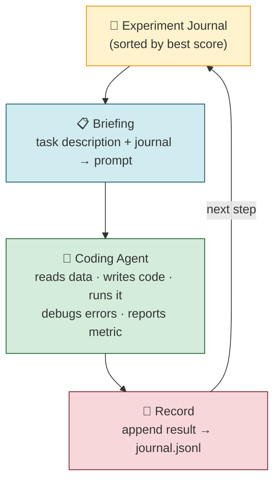
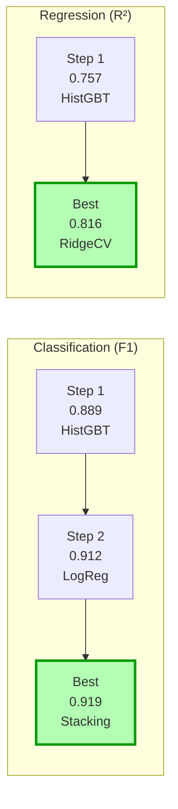
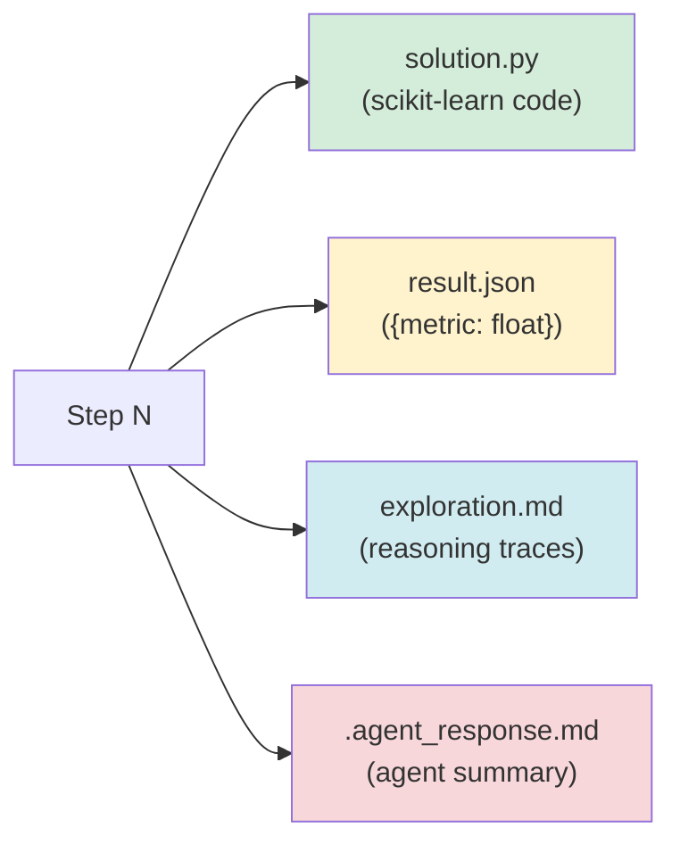

# 🧬 agentic-learn

A self-evolving ML agent that iteratively writes, runs, and improves scikit-learn solutions for tabular data tasks.

> `pip install agentic-learn` → `from aglearn import evolve`

---

## Core Idea

Give a coding agent a task and a journal of past experiments. Each step, it reads the full history, writes a new solution, runs it, and records the result. The framework's only job is **maintain the journal and brief the agent**.



---

## Design Principles

### 🤖 The agent is the execution unit
The coding agent can read files, write code, run it, see errors, fix them, and iterate — all in a single invocation. No manual code extraction, subprocess wrappers, or linter retries needed.

### 📓 Flat journal, not a tree
Every experiment is independent — informed by all past results, but not derived from a parent. The full sorted history gives the agent everything it needs to avoid repeating past work.

### 🎯 Explicit diversity
Without it, the agent collapses into incremental hyperparameter tweaks. The briefing instructs: *"try something meaningfully different from what's in the journal."*

### 🎛️ Steering via instructions
`TaskConfig.instructions` lets a human redirect mid-run — *"focus on ensemble methods"*, *"try feature selection"* — without changing code.

---

## Quickstart

**Prerequisites:** [Codex CLI](https://github.com/openai/codex) installed and authenticated, Python ≥ 3.11.

```bash
python -m venv .venv && source .venv/bin/activate
pip install -e .
```

```python
from aglearn import TaskConfig, evolve

task = TaskConfig(
    description="Binary classification: predict survival on the Titanic.",
    data_path="/path/to/titanic.csv",
    target_column="Survived",
    metric="f1_score",
)

best = evolve(task, model="codex-mini", max_steps=10)
print(best.metric_value)
```

The best solution is saved to `./output/best_solution.py`. Full history lives in `./output/journal.jsonl`. Each step's working directory is preserved under `./output/step_000/`, `./output/step_001/`, etc.

---

## Configuration

| Parameter | Default | Description |
|---|---|---|
| `model` | `codex-mini` | Model passed to `codex exec -m` |
| `max_steps` | `10` | Number of agent invocations |
| `timeout` | `300` | Seconds before an agent run is killed |
| `output_dir` | `./output` | Where journal and step dirs are written |
| `task.instructions` | `""` | Optional human steering (free text) |

---

## Benchmarks

### ⚠️ Synthetic benchmarks (recommended)

Public datasets like Titanic and California Housing are in LLM training data. Use synthetic benchmarks for honest evaluation.

```bash
python examples/synth_classification.py --seed 42 --steps 10
python examples/synth_regression.py --seed 42 --steps 10
```



### Legacy benchmarks (public data — may have knowledge leakage)

| Task | Metric | Baseline | After 10 steps | Run |
|---|---|---|---|---|
| Titanic (binary clf) | F1 | ~0.62 | ~0.82+ | `python examples/titanic.py` |
| California Housing (regression) | R² | ~0.55 | ~0.85+ | `python examples/california_housing.py` |

---

## What Each Step Produces



---

## Project Structure

```
src/aglearn/
├── __init__.py      # Exports: TaskConfig, evolve, Journal, Experiment
├── journal.py       # Experiment dataclass + append-only Journal
├── agent.py         # Codex exec wrapper
├── loop.py          # Briefing builder + evolve loop
└── synth.py         # Synthetic dataset generator (leak-free benchmarks)

examples/
├── synth_classification.py   # Synthetic binary classification (recommended)
├── synth_regression.py       # Synthetic regression (recommended)
├── titanic.py                # Titanic (public data — legacy)
└── california_housing.py     # California Housing (public data — legacy)
```

---

## Requirements

- Python ≥ 3.11
- [Codex CLI](https://github.com/openai/codex) installed and authenticated
