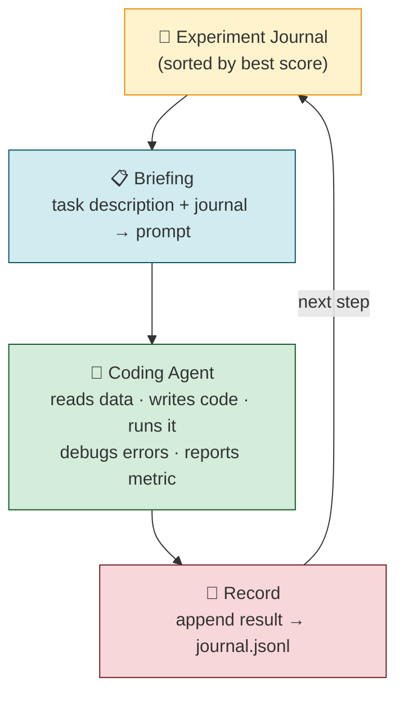
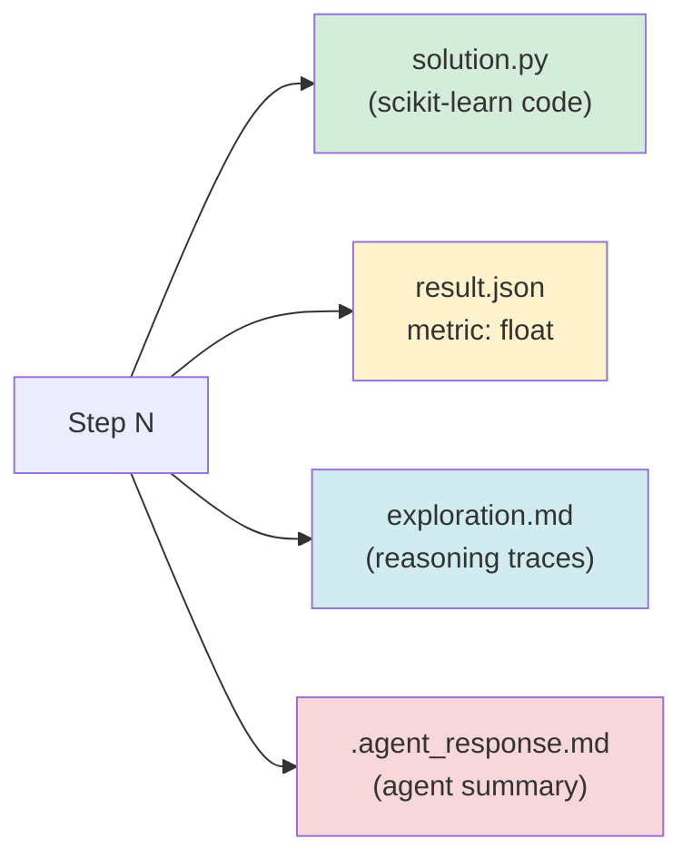

# 🧬 agentic-learn

A self-evolving ML agent that iteratively writes, runs, and improves scikit-learn solutions for tabular data tasks.

> `pip install agentic-learn` → `from aglearn import evolve`

---

## Core Idea

Give a coding agent a task and a journal of past experiments. Each step, it reads the full history, writes a new solution, runs it, and records the result. The framework's only job is **maintain the journal and brief the agent**.



---

## Design Principles

### 🤖 The agent is the execution unit
The coding agent can read files, write code, run it, see errors, fix them, and iterate — all in a single invocation. No manual code extraction, subprocess wrappers, or linter retries needed.

### 📓 Flat journal, not a tree
Every experiment is independent — informed by all past results, but not derived from a parent. The full sorted history gives the agent everything it needs to avoid repeating past work.

### 🎯 Explicit diversity
Without it, the agent collapses into incremental hyperparameter tweaks. The briefing instructs: *"try something meaningfully different from what's in the journal."*

### 🎛️ Steering via instructions
`TaskConfig.instructions` lets a human redirect mid-run — *"focus on ensemble methods"*, *"try feature selection"* — without changing code.

---

## Quickstart

**Prerequisites:** Python ≥ 3.11 and at least one supported agent CLI installed.
The core loop defaults to [Codex CLI](https://github.com/openai/codex).

```bash
uv sync --dev
```

```python
from aglearn import TaskConfig, evolve

task = TaskConfig(
    description="Tabular classification on a generated training split.",
    data_path="/path/to/train.csv",
    target_column="target",
    metric="f1",
)

best = evolve(task, model="gpt-5-codex", max_steps=10)
print(best.metric_value)
```

The best solution is saved to `./output/best_solution.py`. Full history lives in `./output/journal.jsonl`. Each step's working directory is preserved under `./output/step_000/`, `./output/step_001/`, etc.

---

## Scope

This repo now contains only the reusable learning loop: runtime CLI invocation,
journaling, synthetic task helpers, and iterative solution search. Benchmark
generation and leaderboard orchestration have moved to a dedicated benchmarking
repo.

---

## Configuration

| Parameter | Default | Description |
|---|---|---|
| `model` | `codex-mini` | Model passed to the configured CLI runner |
| `max_steps` | `10` | Number of agent invocations |
| `timeout` | `300` | Seconds before an agent run is killed |
| `output_dir` | `./output` | Where journal and step dirs are written |
| `task.instructions` | `""` | Optional human steering (free text) |
| `task.resource_paths` | `{}` | Extra files exposed to the agent, such as sample submissions or helper scripts |

---
---

## What Each Step Produces



---

## Project Structure

``` 
src/aglearn/
├── __init__.py         # Public package exports
├── runtime/
│   ├── agent.py        # CLI runner configs + agent invocation
│   └── loop.py         # Briefing builder + evolve loop
├── storage/
│   └── journal.py      # Experiment dataclass + append-only Journal
├── data/
│   ├── synth.py        # Synthetic Kaggle-style dataset generator
│   └── synth_hard.py   # Harder synthetic benchmark generators
```

---

## Requirements

- Python ≥ 3.11
- [Codex CLI](https://github.com/openai/codex) installed and authenticated
