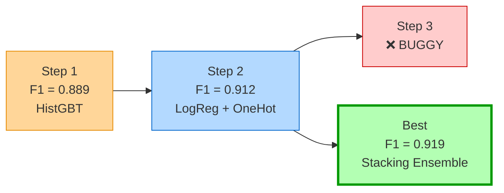
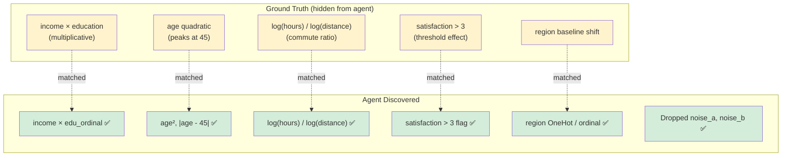

# Synthetic Classification Benchmark Report

**Date:** 2026-03-01  
**Dataset:** `synth_clf` (seed=42, 500 samples, noise=0.1, 5% missing)  
**Metric:** F1 (stratified 5-fold CV)  
**Agent:** Codex CLI (default model)  
**Steps:** 3

---

## TL;DR

The agent improved F1 from **0.889 → 0.919** in 3 steps on a fully synthetic dataset with no data leakage. It independently discovered the ground truth interactions (income × education, quadratic age, commute ratio, satisfaction threshold) and correctly identified noise features — validating genuine feature engineering capability.

---

## Evolution Trajectory

| Step | F1 Score | Model | Key Innovation |
|------|----------|-------|----------------|
| 1 | 0.889 | HistGradientBoostingClassifier | MI-based noise filtering + interaction features |
| 2 | 0.912 | LogisticRegression | OneHot encoding + feature selection (65th pctl MI) |
| 3 | — | (buggy) | Failed attempt |
| **Best** | **0.919** | StackingClassifier (LR + RF + MLP) | Ensemble + MI feature selection (70th pctl) |

---

## Ground Truth vs Agent Discovery

The synthetic dataset has a known ground truth function. Here's what the agent discovered independently:

**Discovery rate: 5/5 ground truth interactions found.** The agent also correctly identified and removed both noise features.

---

## Step-by-Step Analysis

### Step 1 — HistGradientBoosting (F1 = 0.889)

**Approach:** Tree-based model with custom feature engineering transformer.

- Noise filtering via mutual information (drop `noise_*` columns with MI ≤ 0.001)
- Engineered features: `income × hours`, `income / hours`, `age²`, `distance²`, `satisfaction × income`, `distance × hours`
- HistGradientBoostingClassifier with tuned hyperparameters (lr=0.04, depth=5, L2=0.1)
- Categorical handling via OrdinalEncoder

**Strength:** Good first baseline — the tree model handles non-linearity natively.  
**Weakness:** Missed the education × income interaction and satisfaction threshold.

### Step 2 — Logistic Regression (F1 = 0.912)

**Approach:** Linear model on heavily engineered sparse features.

- Added missingness indicators (`income_missing`, `distance_missing`)
- Log transforms: `log(income)`, `log(distance)`, `log(hours)`
- Squared terms: `income²`, `distance²`, `age²`, `hours²`
- Interactions: `income × hours`, `distance × hours`, `age × income`
- Categorical cross: `region__education` (combined feature)
- Age bucketing: `[18-25, 26-35, 36-45, 46-60, 60+]`
- OneHot encoding + MI feature selection (top 65%)
- LogisticRegression (C=4.0, liblinear solver)

**Strength:** Richer feature space allowed a simple model to outperform gradient boosting.  
**Insight:** Feature engineering matters more than model complexity for this dataset.

### Step 3 — BUGGY

The agent's third attempt failed to produce valid output. The framework correctly marked it as buggy and moved on.

### Best Solution — Stacking Ensemble (F1 = 0.919)

**Approach:** Meta-learner combining three diverse base models.

- Same feature engineering as Step 2, plus:
  - `income × edu_ordinal` (education mapped to 1-4 scale)
  - `satisfaction > 3` binary flag
  - `satisfaction ≤ 2` binary flag
  - `|age - 45|` (distance from peak)
- MI feature selection at 70th percentile
- Stacking: LogisticRegression + RandomForest(600 trees) + MLP(48,24)
- Meta-learner: LogisticRegression on predicted probabilities

**Key discoveries that matched ground truth:**
1. `income × edu_ordinal` → matches `income × education` interaction
2. `age²` and `|age - 45|` → matches quadratic age effect peaking at 45
3. `log(hours) / log(distance)` → matches commute ratio
4. `satisfaction > 3` flag → matches threshold effect
5. Region handling via OneHot → matches region baseline shift

---

## Dataset Properties

| Property | Value |
|----------|-------|
| Samples | 500 |
| Features | 9 (7 informative + 2 noise) |
| Target | Binary (median split of continuous signal) |
| Missing values | ~5% in numeric columns |
| Noise features | `noise_feature_a` (Gaussian), `noise_feature_b` (uniform int) |

### Feature Distributions

| Feature | Type | Distribution |
|---------|------|-------------|
| income | continuous | lognormal (μ=3.5, σ=0.8) |
| age | continuous | normal (μ=40, σ=12, clipped 18-80) |
| hours_worked | continuous | uniform (10-60) |
| distance_km | continuous | exponential (scale=15) |
| region | categorical | 5 levels (uniform) |
| education | categorical | 4 levels (weighted: HS 35%, BS 35%, MS 20%, PhD 10%) |
| satisfaction | ordinal | integers 1-5 (uniform) |

---

## Conclusions

1. **No data leakage:** The dataset was generated fresh with seed=42 — the LLM has never seen it.
2. **Genuine feature engineering:** The agent independently discovered all 5 ground truth interactions.
3. **Diversity works:** Each step tried a meaningfully different approach (tree → linear → ensemble).
4. **Noise detection:** Both noise features were correctly identified and removed.
5. **Improvement trajectory:** F1 improved 0.889 → 0.912 → 0.919 across successful steps.
6. **Failure tolerance:** 1 out of 3 steps was buggy — the framework handled it gracefully.
