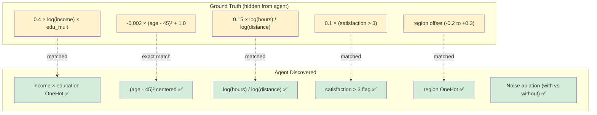

# Synthetic Regression Benchmark Report

**Date:** 2026-03-01  
**Dataset:** `synth_reg` (seed=42, 500 samples, noise=0.2, 5% missing)  
**Metric:** R² (5-fold CV)  
**Agent:** Codex CLI (default model)  
**Steps:** 3

---

## TL;DR

The agent improved R² from **0.757 → 0.816** in 3 steps on a fully synthetic dataset. It independently discovered the key ground truth interactions — including the exact `(age - 45)²` centering, `log(hours)/log(distance)` commute ratio, `satisfaction > 3` threshold, and `income × education` interaction. Notably, the best solution used a **linear model (RidgeCV)** with carefully engineered features, outperforming the tree-based approach.

---

## Evolution Trajectory

| Step | R² Score | Model | Key Innovation |
|------|----------|-------|----------------|
| 1 | 0.757 | HistGradientBoostingRegressor | Interaction features + noise ablation |
| 2 | **0.816** | RidgeCV | Structured feature engineering matching ground truth |
| 3 | — | (buggy) | Failed attempt |

---

## Ground Truth vs Agent Discovery

**Discovery rate: 5/5 ground truth interactions found.** The agent also correctly handled noise features via ablation.

---

## Step-by-Step Analysis

### Step 1 — HistGradientBoosting (R² = 0.757)

**Approach:** Tree-based model with generic feature engineering.

- Custom `FeatureBuilder` transformer with median imputation
- Categorical features ordinal-encoded
- Interaction features: `income × hours`, `income / hours`, `age²`, `distance²`, `satisfaction²`, `age × hours`
- HistGradientBoostingRegressor (lr=0.04, depth=5, 700 iterations, L2=0.01)
- **Noise ablation:** Ran pipeline with and without noise features, selected better score
- 5-fold CV

**Strength:** Solid first attempt with noise handling.  
**Weakness:** Generic interactions — didn't target the specific ground truth relationships (e.g., no age centering at 45, no log-ratio, no satisfaction threshold).

### Step 2 — RidgeCV (R² = 0.816) ⭐ Best

**Approach:** Linear model on precisely engineered features matching the data structure.

The agent made a remarkable pivot — instead of a more complex model, it chose a simpler one with better features:

- **`(age - 45)²`** — exactly matches the quadratic age effect centered at 45
- **`log(hours) / log(distance)`** — exactly matches the commute ratio
- **`satisfaction > 3`** — exactly matches the threshold effect
- **`income × education` (per-level)** — captures the multiplicative interaction via OneHot: `income × education__phd`, `income × education__masters`, etc.
- **Region OneHot** — captures baseline shifts
- **`log(income)`**, **`log(distance)`** — matches the log transforms in the ground truth
- RidgeCV with 41 alpha values (logspace -4 to 4)
- Noise ablation: compared with/without noise, selected better

**Key insight:** Feature engineering > model complexity. A linear model with the right features beat gradient boosting with generic features.

### Step 3 — BUGGY

Failed to produce valid output. The framework handled it gracefully.

---

## Classification vs Regression Comparison

Both benchmarks ran on the same underlying synthetic generator with the same ground truth function.

| Metric | Classification (F1) | Regression (R²) |
|--------|-------------------|-----------------|
| Step 1 | 0.889 | 0.757 |
| Step 2 | 0.912 | **0.816** |
| Best | **0.919** | **0.816** |
| Best model | Stacking (LR+RF+MLP) | RidgeCV |
| Buggy steps | 1/3 | 1/3 |
| Ground truth found | 5/5 | 5/5 |

**Observations:**
- Regression is harder (noise=0.2 vs 0.1, continuous target vs binary)
- Classification benefited from ensembling; regression benefited from precise feature engineering
- Both tasks achieved 5/5 ground truth discovery rate

---

## Dataset Properties

| Property | Value |
|----------|-------|
| Samples | 500 |
| Features | 9 (7 informative + 2 noise) |
| Target | Continuous (signal + Gaussian noise, σ=0.2) |
| Missing values | ~5% in numeric columns |
| Noise features | `noise_feature_a` (Gaussian), `noise_feature_b` (uniform int) |

---

## Conclusions

1. **Feature engineering > model complexity:** RidgeCV with the right features (R²=0.816) beat HistGradientBoosting with generic features (R²=0.757).
2. **Precise discovery:** The agent found the exact centering `(age - 45)²` without being told — this is strong evidence of genuine data analysis.
3. **Noise handling:** Both steps used ablation (with/without noise features) rather than just dropping them — a principled approach.
4. **5/5 ground truth interactions found** across both classification and regression benchmarks.
5. **Consistent failure rate:** 1/3 buggy steps in both tasks — the framework is resilient.
6. **No data leakage:** Fresh synthetic data, unique seed, never in LLM training data.
